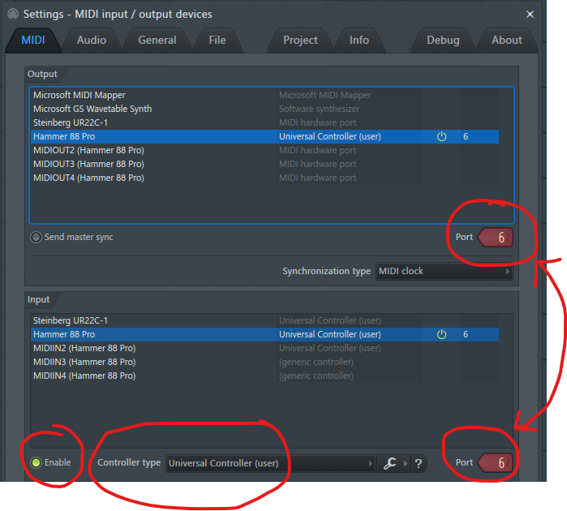

# Setup

To install the script, the following steps are recommended:

1.  Make sure you're in the [Discord server](https://discord.gg/6vpfJUF), so
    that you'll get notified when updates are released. You can also ask for
    tech support there.
2.  If you're on Windows, install Git (it should be pre-installed on MacOS and
    Linux) so that the script can be updated easily.
3.  Navigate to `Documents/Image-Line/FL Studio/Settings/Hardware` in your file
    manager and use the right click menu to open it in a terminal (you might
    need to use "See more options" on Windows).
4.  Run the command `git clone --recursive https://github.com/MiguelGuthridge/Universal-Controller-Script.git`
    which will download and install the script.
5.  Launch (or close and relaunch) FL Studio, and open the MIDI Settings window.
6.  Set your desired controller's ports to be the same (non-zero) value in both
    the input and output sections. Refer to the image for an example setup.
7.  Select the controller in the input section, and change the controller type
    to `Universal Controller (user)`. Make sure the controller is enabled.
8.  Navigate to the script output window (View > Script output), and select your
    device's tab.
9.  Wait 3 seconds - if no errors appear, your device was detected successfully.
10. Familiarise yourself with your device's specific functionality in the
    [devices section](devices/README.md), making sure to complete any additional
    setup requirements. Enjoy using your device!
12. If you get an error, then your device couldn't be detected. Usually this
    means that your device doesn't have a definition (I'd love if you
    [contributed one](contributing/README.md)), but if you're sure your
    device does, it may just need some manual configuration. Refer to its manual
    page in the [devices section](devices/devices.md).

## Images

